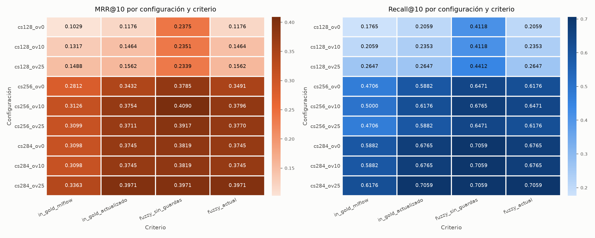

# Metodología de evaluación — criterio de acierto y ground truth

Todos los `recall@k` y `mrr@k` del proyecto dependen de una sola decisión — si un chunk recuperado cuenta como acierto. La toma `is_chunk_correct()` (`shared/eval/metrics.py`), comparando el chunk contra el **ground truth** del proyecto, los `gold_spans` de [questions.jsonl](./questions.jsonl). Es la base de la **evaluación con métricas** de retrieval en los experimentos de chunking, hybrid search, reranking y evaluation.

| Área | Qué resuelve este documento |
|---|---|
| Evaluación con métricas | Criterio de acierto de retrieval y su efecto sobre `recall@k`/`mrr@k` |
| Decisiones de calidad | Calibración del umbral de cobertura con casos revisados a mano |
| Data quality | Auditoría del ground truth y corrección por drift del corpus |
| Testing + CI | Tests unitarios y de regresión que fijan el criterio, corridos en CI (sin CD, no hay despliegue todavía) |
| Grounding | Ground truth limpio como prerequisito de las métricas de groundedness y answer correctness |

## Criterio de acierto de retrieval

Un chunk es acierto si cumple las cuatro condiciones, en este orden.

1. **Documento correcto** — `chunk["doc_id"]` está entre los `source_doc` de la pregunta.
2. **Similitud léxica** — sobre texto normalizado (`_normalize`, minúsculas, sin `**`/`__`, espacios colapsados) y con el `text` del chunk unido a sus tablas por un espacio, `fuzz.partial_ratio_alignment(span, chunk)` da un score `≥ 0.8`.
3. **Cobertura del span** — `min(largo alineado en el span, largo alineado en el chunk) / len(span) ≥ 0.9`. Detecta chunks truncados.
4. **Consistencia numérica** — los números del span (`_find_numbers`) aparecen en el mismo orden dentro de la ventana del chunk que hizo match, no en cualquier otra parte del chunk.

| Condición | Tolera | Rechaza (evita falsos positivos) |
|---|---|---|
| Score `≥ 0.8` | Espacios, pipes de tabla, un typo, una redacción levemente distinta | Texto que no se parece |
| Cobertura `≥ 0.9` | Diferencias menores en los bordes del span | Chunks truncados que contienen solo una parte del span |
| Números en la ventana | Cifras idénticas en orden | Cifras invertidas o cambiadas, aunque el resto de la oración coincida |

## Por qué matching tolerante con guardas

Los dos extremos fallan en direcciones opuestas.

- **`in` estricto** (`_normalize(span) in chunk`) — exige cada carácter. Cualquier diferencia de transcripción en el ground truth (un backtick, una paráfrasis) produce un **falso negativo** y subestima el recall.
- **`partial_ratio` sin guardas** — busca la cadena más corta dentro de la más larga, sin dirección. Si el chunk está truncado, termina midiendo *el chunk dentro del span* y da un score alto aunque falte la mitad de la respuesta. Tampoco distingue `22050, no 44100` de `44100, no 22050`. Produce **falsos positivos** y sobreestima el recall.

Para un experimento de chunking el segundo caso es crítico — el truncamiento es justamente lo que el barrido existe para penalizar. La cobertura devuelve esa sensibilidad sin perder la tolerancia, y la consistencia numérica cubre las cifras alteradas.

## Calibración del umbral de cobertura

Se revisaron a mano todos los pares (pregunta, chunk) del barrido de chunking que superan el score `0.8` con números correctos pero no cubren el span completo (revisión manual del barrido del 2026-10-05).

| Pregunta | Cobertura | Configs | Qué le falta a la ventana | Veredicto |
|---|---|---|---|---|
| `q030` | 0.984 | `cs284_ov25` | Nada — mismo dato redactado en otra oración (*"con 16 procesos… 3.12×"*) | Verdadero positivo |
| `q025` | 0.897 | `cs128_ov10` | La primera palabra (*"calculados"*) | Truncado |
| `q011` | 0.855 | `cs284_ov0/10/25` | Termina en *"…no"*, pierde *"entre sí"* y se invierte el sentido | Truncado |
| `q009` | 0.834 | `cs128_ov*` | Corta antes de *"default con más frecuencia…"* | Truncado |
| `q025` | 0.813 | `cs128_ov0` | El comienzo del span | Truncado |
| `q012` | 0.753 | `cs128_ov*` | Corta antes de *"…se confunda con el tempo real"* | Truncado |
| `q031` | 0.710 | `cs128_ov0`, `cs256_ov*` | La fórmula `(√v - √lo) / (√hi - √lo)` queda a la mitad | Truncado |
| `q006` | 0.637 | `cs128_ov25` | La primera mitad del span | Truncado |

Todo lo que queda bajo `0.9` es truncamiento real y lo único por encima es un verdadero positivo. Con `0.9` y `0.95` los resultados son idénticos en las 9 configs, por eso queda `0.9` — el margen es chico, `q025` está en `0.897`. En el mismo barrido la consistencia numérica no rechazó por sí sola ningún verdadero positivo (ningún par con cobertura `≥ 0.9` falla solo por números).

## Comparación de criterios sobre el mismo retrieval

Top-10 congelado por config, evaluado con cada criterio. `recall@5 / mrr@10` sobre las 34 preguntas, fuente [matcher_comparison.csv](../../experiments/chunking/results/matcher_comparison.csv). Los cuatro criterios son `in_gold_mlflow` (`in` estricto con `questions.jsonl` de `2066799^`), `in_gold_actualizado` (`in` estricto con el ground truth actual), `fuzzy_sin_guardas` (solo `partial_ratio ≥ 0.8`, versión de `2066799`) y `fuzzy_actual` (versión actual de `is_chunk_correct`). `in_gold_mlflow` usa `questions.jsonl` de `2066799^` y reproduce exactamente las corridas originales registradas en MLflow (`exp_chunking_dynamic_tables`), lo que confirma que la comparación es reproducible contra el tracking histórico.

| Config | `in_gold_mlflow` | `in_gold_actualizado` | `fuzzy_sin_guardas` | **`fuzzy_actual`** |
|---|---|---|---|---|
| `cs128_ov0` | 0.147 / 0.103 | 0.176 / 0.118 | 0.353 / 0.238 | 0.176 / 0.118 |
| `cs128_ov10` | 0.176 / 0.132 | 0.206 / 0.146 | 0.324 / 0.235 | 0.206 / 0.146 |
| `cs128_ov25` | 0.235 / 0.149 | 0.235 / 0.156 | 0.324 / 0.234 | 0.235 / 0.156 |
| `cs256_ov0` | 0.412 / 0.281 | 0.471 / 0.343 | 0.529 / 0.379 | 0.500 / 0.349 |
| `cs256_ov10` | 0.382 / 0.313 | 0.471 / 0.375 | 0.500 / 0.409 | 0.471 / 0.380 |
| `cs256_ov25` | 0.382 / 0.310 | 0.471 / 0.371 | 0.529 / 0.392 | 0.500 / 0.377 |
| `cs284_ov0` | 0.412 / 0.310 | 0.559 / 0.374 | **0.588** / 0.382 | 0.559 / 0.374 |
| `cs284_ov10` | 0.412 / 0.310 | 0.559 / 0.374 | **0.588** / 0.382 | 0.559 / 0.374 |
| `cs284_ov25` | **0.441 / 0.336** | **0.559 / 0.397** | 0.559 / 0.397 | **0.559 / 0.397** |
| Config ganadora | `cs284_ov25` | `cs284_ov25` | `cs284_ov0` / `ov10` | `cs284_ov25` |

- **Los falsos positivos cambian la decisión.** Sin guardas, `cs284_ov0/ov10` suben a `0.588` solo por el chunk truncado de `q011` (cobertura 0.855), y el barrido elegiría otra config. En `cs128_ov0` el recall pasa de `0.176` a `0.353`, 6 preguntas más en el top-5 que `fuzzy_actual` rechaza por cobertura o números. Con `recall@10`, la métrica de decisión vigente desde el 2026-10-06, el fuzzy sin guardas ya no cambia la ganadora (empata `cs284_ov0/ov10/ov25` en `0.706` y desempata `mrr@10` a favor de `cs284_ov25`), pero sigue inflando las configs de 128 (`cs128_ov0`: `recall@10=0.412` contra `0.206`). La tabla de arriba está en `recall@5` porque es la métrica con la que se tomó la decisión original.
- **La mejora en la config ganadora viene del ground truth, no del criterio.** Comparando `in_gold_mlflow` contra `in_gold_actualizado` en `cs284_ov25` (de `0.441` a `0.559`, 4 preguntas más en el top-5), `q001` sube de rank 6 a 2 (fila de tabla agregada a sus `gold_spans` en `2066799`), `q002` de 7 a 2, `q027` entra en rank 1 y `q029` en rank 4 (gold spans corregidos, ver data quality). Con el ground truth auditado, `in_gold_actualizado` y `fuzzy_actual` coinciden en las tres configs de 284.
- **`fuzzy_actual` aporta robustez, no recall** — no infla con truncamientos y tolera la diferencia de redacción que queda en `cs256_ov0/ov25`, donde `q028` acierta con la misma fórmula (`-2.276·kernel + 55.55`) en una segunda ocurrencia del documento redactada distinto.

En la config ganadora, `in_gold_actualizado`, `fuzzy_sin_guardas` y `fuzzy_actual` dan el mismo recall en todos los `k` medidos, y solo `in_gold_mlflow` queda por debajo: la diferencia en esa config es del ground truth ([matcher_comparison.csv](../../experiments/chunking/results/matcher_comparison.csv), `cs284_ov25`).

| Criterio | `recall@1` | `recall@3` | `recall@5` | `recall@10` | `mrr@10` |
|---|---|---|---|---|---|
| `in_gold_mlflow` | 0.235 | 0.382 | 0.441 | 0.618 | 0.336 |
| `in_gold_actualizado`, `fuzzy_sin_guardas`, `fuzzy_actual` | 0.265 | 0.471 | 0.559 | 0.706 | 0.397 |

En el barrido completo se ve dónde divergen. `fuzzy_sin_guardas` se separa del resto en las configs de 128 (chunks cortos, más truncamientos) y en `cs284_ov0/ov10`.

La corrida oficial del experimento con `fuzzy_actual` da los mismos números que la columna `fuzzy_actual` — experimento MLflow `exp_chunking_dynamic_tables`, corridas del 2026-10-05, con el barrido completo en la [fase 4 del experimento de chunking](../../experiments/chunking/PHASES.md).

## Data quality del ground truth

Un gold span tiene que ser texto literal de su fuente y contener el núcleo de la respuesta — es la referencia contra la que se mide todo lo demás, y el matching tolerante no debería tapar errores del dato. La auditoría encontró dos tipos de problema en 5 de las 34 preguntas. En 3, el span no aparecía literal en su `source_doc` (`tests/data/test_gold_spans.py`, con el score del fragmento más cercano). En otras 2, el span era literal pero no contenía la respuesta, detectado al analizar por qué su chunk quedaba fuera del top-80 (`python -m tests.data.ranking_report` con `K=100`).

| Pregunta | Score | Tipo de error | Corrección |
|---|---|---|---|
| `q002` | 0.993 | Error de transcripción — se perdieron los backticks de `` `kernel_size=9` `` | Copiado literal de `tagger-music-genesis.md` |
| `q014` | 0.966 | Paráfrasis — *"subestimaba… a 96"* en vez de *"subestima… a escala de 96"* | Copiado literal de `music-tagger-benchmark.md` |
| `q012` | 0.652 | **Drift del corpus** — el documento se reescribió el 2026-08-18 tras verificar contra el código que el SR vigente es 22050, y la frase original (*"afecta directamente `compute_lra()`"*) dejó de existir | Reemplazado por la frase actual de `tagger-music-genesis.md` |
| `q027` | — | **Span mal elegido** — tomaba la aclaración secundaria (*"no media ± 2 errores estándar…"*), que cruzaba el límite del chunk. El pasaje con la respuesta ya salía primero | Reemplazado por el núcleo (*"…es la media de los 5 folds ± 2 veces la desviación estándar…"*) |
| `q029` | — | **Span mal elegido** — describía cómo se pondera el promedio, no la métrica ni su valor | Reemplazado por dos spans, la frase con `silhouette_score` y la fila de tabla con `0.0085` |

Después de la corrección, los 45 spans de las 34 preguntas son literales (`test_gold_spans.py` en verde).

> **Impacto en grounding** — el `expected_answer` de `q012` todavía afirma que el cambio de SR afecta `compute_lra()`, algo que el corpus ya no respalda. No influye en `recall@k` (solo se usan los `gold_spans`), pero sí en las métricas de generación que comparen respuestas contra `expected_answer` (groundedness, answer correctness).

## Latencias (p50 / p95)

`percentile()` (`shared/eval/metrics.py`) interpola linealmente entre los dos valores vecinos de la posición `k = (n − 1) · p / 100`, igual que `np.percentile` por defecto. Lo usan `latency_summary()` (los `p50_ms`/`p95_ms` de cada run en MLflow) y `experiments/evaluation/generative/measure_resources.py`.

> **Cambio del 2026-10-08** — antes tomaba el valor observado en `round(k)`, con el redondeo al par de Python. Con `n` par (las 34 preguntas) su p50 no era la mediana: en `[10, 20, 30, 40]` daba `30` en vez de `25`. Las latencias registradas antes de esa fecha (MLflow, `results.json` y reportes) usan el método anterior y no se recalcularon, porque no se guardaron las latencias por pregunta. La diferencia es de décimas de ms y ninguna decisión del proyecto se tomó por latencia.

## Testing + CI

Los tests unitarios corren con [`ci.yml`](../../.github/workflows/ci.yml) en cada push, sin dependencias pesadas. Los casos sintéticos y los reales van en archivos separados.

- [`tests/unit/test_chunk_correct_synthetic.py`](../../tests/unit/test_chunk_correct_synthetic.py) — **casos sintéticos**, sin depender del corpus. 6 que deben ser acierto (mismo dato con otro formato: espacios, negrita, backticks, typo, fila de tabla con otro padding) y 8 que no (número cambiado, números invertidos con y sin los correctos en otra oración, número faltante, truncado al inicio y al final, misma estructura con otro modelo, documento equivocado).
- [`tests/unit/test_chunk_correct_real.py`](../../tests/unit/test_chunk_correct_real.py) — **tests de regresión** con chunks reales ([`real_chunks.json`](../../tests/fixtures/real_chunks.json)) de `q002`, `q014` y `q028` (deben ser acierto) y el truncado de `q011` (debe ser rechazo).
- [`tests/unit/test_metrics.py`](../../tests/unit/test_metrics.py) — `_find_numbers`, `recall_at_k`, `mrr`, `percentile`, `latency_summary`, `bootstrap_ci` y las tasas de groundedness sobre valores calculables a mano.

Contra las versiones anteriores del criterio, `fuzzy_sin_guardas` falla los 7 sintéticos de dato alterado y el real `q011`, y el `in` estricto falla los sintéticos de backticks y typo y los reales `q002`, `q014` y `q028`. Una regresión en cualquiera de las dos direcciones rompe el CI.
- [`tests/data/test_gold_spans.py`](../../tests/data/test_gold_spans.py) — **data quality check** que exige que todo gold span sea literal en su fuente y, si falla, lista cuáles. Detecta el drift del corpus automáticamente. Necesita el corpus (`shared/corpus/`, fuera del repo), por eso corre localmente y no en CI.

Para reproducir la comparación de criterios, `python -m experiments.chunking.results.compare_matchers` (requiere Qdrant y el embedder levantados).

> Los resultados de hybrid search y reranking (`experiments/hybrid-search/results/results.json`, `experiments/reranking/results/results.json`) se calcularon con el criterio estricto y el ground truth anterior a esta auditoría.
